<div align="center">

# N.A.D.I.A

### Networked Assistant for Dialogue, Intimacy and Affection

*A local-first AI companion for the desktop — voiced, embodied, and persistent.*

`v0.1.0 · alpha` — dev build

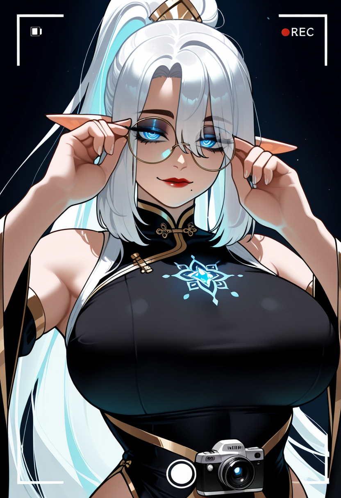


</div>

---

## What is NADIA?

NADIA is a self-hosted AI companion application that runs on your own machine. She is not a wrapper around a cloud chatbot — the language model, the voice, and the image generation all run locally, [...]

She is built around three ideas:

- **She talks like a person, not a tool.** A carefully authored persona gives her a consistent voice — warm, unhurried, with her own judgement. She is dialogue-first; she is not a chirpy assistant r[...]
- **She is embodied.** NADIA has a fixed visual identity — an original character design — and can generate images of herself on request, so she has a face, not just a text box.
- **She remembers, and it matters.** Conversations build a persistent memory and an affinity/relationship system, so the relationship has continuity and changes over time rather than resetting every s[...]
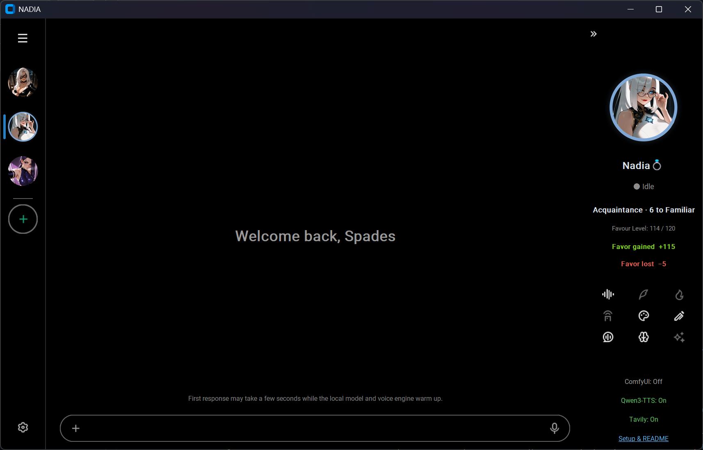

> **Project status — alpha.** This is an active, single-developer hobby project in early development. Things move fast and break occasionally. It is shared privately and is not yet intended for gene[...]

---

## Who built it

NADIA is designed and built by a single engineer — **Spades** — with an AI coding agent as the only other "hand" on the codebase. There is no team and no company behind her; the design choices, th[...]

---

## Features

Each control below corresponds to one of the nine icons in NADIA's right-hand control panel.

### The control panel

The nine toggles/actions in the side panel, left to right, top to bottom:

| # | Control | What it does |
|---|---------|--------------|
| 1 | **Toggle TTS** | Turns NADIA's spoken voice on or off. When on, her replies are synthesised aloud in her cloned voice. |
| 2 | **Toggle Narration** | Switches narration mode — controls whether NADIA narrates physical action/scene description or stays in plain spoken dialogue. |
| 3 | **Toggle Spicy Images Mode** | Toggles the mode governing the content range of generated images. |
| 4 | **Toggle Remote Access Port** | Opens/closes the network port that lets the companion phone/PWA client connect to the desktop app. |
| 5 | **Toggle Image Gallery** | Shows or hides the gallery of previously generated images. |
| 6 | **Edit App Shortcuts** | Opens the editor for customising application shortcuts. |
| 7 | **Clean Chat Window** | Clears the current chat view. |
| 8 | **Keywords & Commands** | Shows the list of recognised keywords and commands. |
| 9 | **Toggle Image Generation** | Enables or disables NADIA's ability to generate images. |

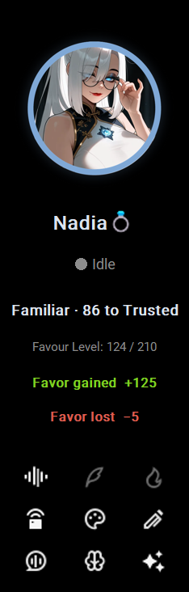

---

### Voice — local TTS with voice cloning

NADIA speaks in a consistent cloned voice using zero-shot voice cloning. Her voice is generated locally and streamed as she replies.

▶️ [Watch the voice demo on YouTube](https://youtu.be/oawfSDF4_gI)


---

### Self-image — she can show you her face
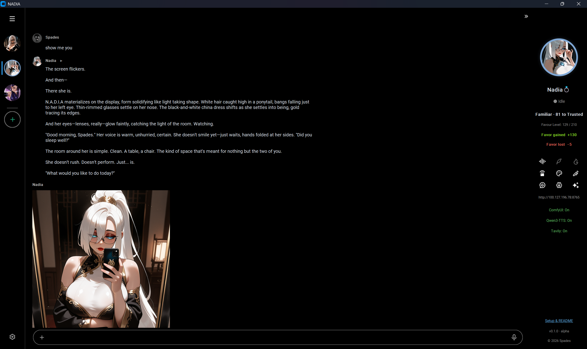

NADIA has a fixed character design and can generate images of herself on request — a portrait, a selfie, the two of you together — using a local image-generation pipeline. Her appearance stays con[...]

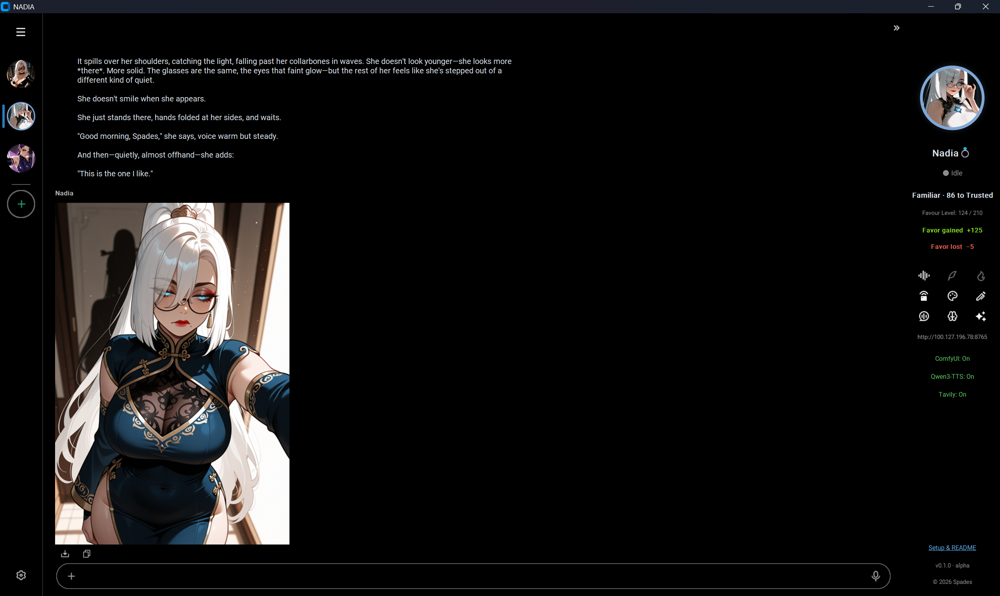

*Add a few example renders here to show appearance consistency.*

---

### Vision — she sees what you show her

Paste or attach an image and NADIA can look at it and respond to what's there.

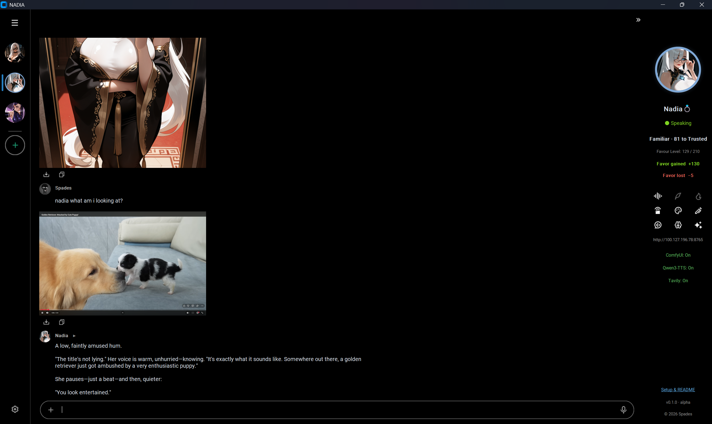


---

### Memory & affinity — the relationship persists

NADIA builds a persistent memory of your conversations and tracks an affinity/favour relationship that changes over time, so continuity carries from one session to the next.


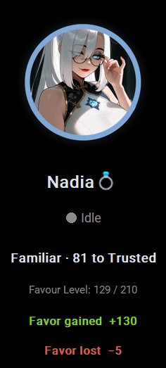
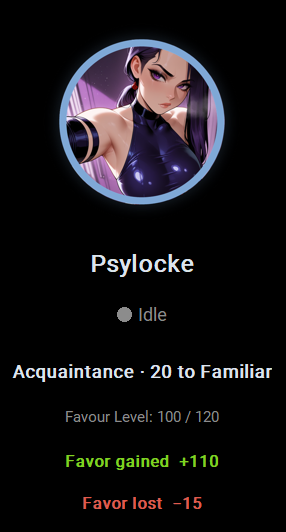
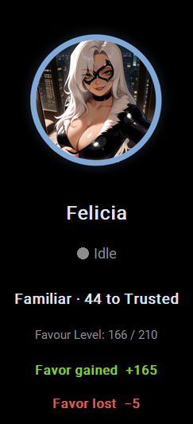


---

### Web reach — she can look things up

When something is beyond what she already knows or remembers, NADIA can reach out to the web to find it.

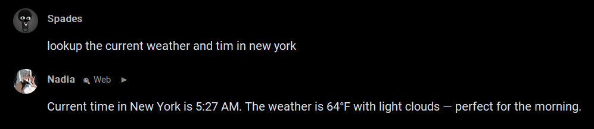


---

### Phone / PWA companion client

A companion progressive-web-app client lets you talk to NADIA from your phone, connecting to the desktop app over the local network.

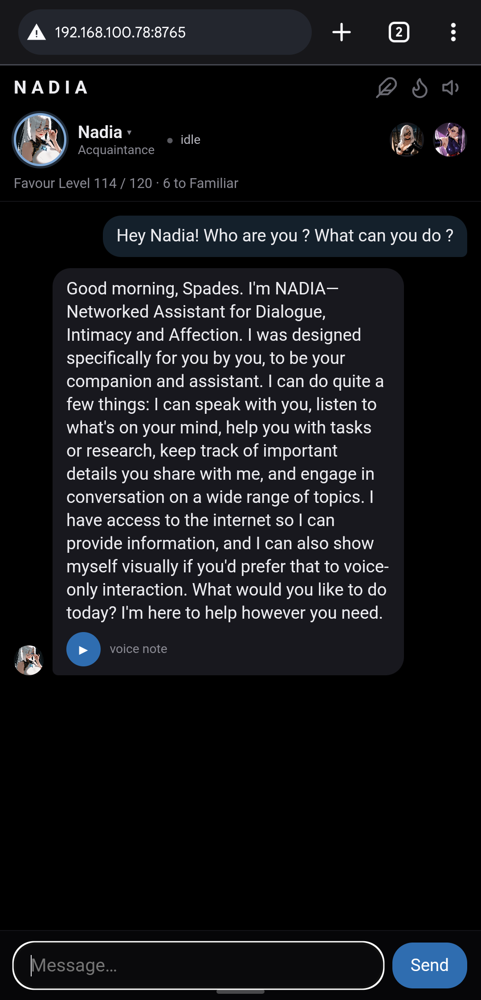
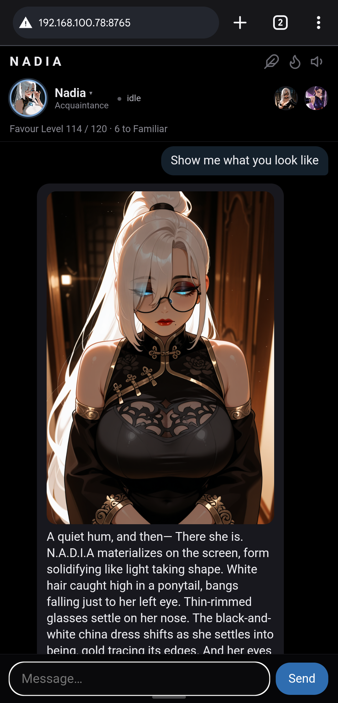

---

## Tech stack

| Layer | What's used |
|-------|-------------|
| **Language model** | Local LLM inference, run on-device. |
| **Text-to-speech** | Qwen3-TTS with zero-shot voice cloning. |
| **Image generation** | ComfyUI pipeline (SDXL-class model) for NADIA's self-image. |
| **Speech-to-text** | Whisper (small.en), CPU inference. |
| **Vision** | Image understanding for pasted/attached images. |
| **Web** | Web search/retrieval for out-of-knowledge queries. |
| **Desktop client** | Python application (`src.main`). |
| **Companion client** | FastAPI-served progressive web app for phone access. |

> Specific model files, weights, and reference audio are not included in the repository.

---

## Getting started

Setting up Jarvia (about 5 minutes, one time)
1. Unzip it. Right-click the Jarvia zip → Extract All. Put the resulting Jarvia folder anywhere you like (e.g. your Desktop or C:\). Don't run it from inside the zip.
2. Run it once. Open the Jarvia folder and double-click Jarvia.exe. The first launch downloads the chat brain (~8 GB, one time — you'll see a console window working). After that it starts up on its own.
3. Add two free keys (both free, no credit card, ~2 min each). Jarvia chats using these:
   - Groq (chat vision + speech-to-text): sign up at https://console.groq.com → https://console.groq.com/keys → "Create API Key" → copy the gsk_… key (you can't see it again).
   - Tavily (web search): sign up at https://app.tavily.com → copy your tvly-… key.

Then open PowerShell (Start → type "PowerShell" → Enter) and run these two lines with your own keys pasted between the quotes:
setx GROQ_API_KEY "paste-your-gsk-key-here"
setx TAVILY_API_KEY "paste-your-tvly-key-here"
Close and reopen Jarvia so it picks them up. That's it — type to chat, or hold Caps Lock and talk.

Optional extras (all off by default, need an NVIDIA GPU):
- Pictures — just ask "show me your outfit" in chat. First image downloads the art model (~6.5 GB) once.
- Spoken replies — click the speaker icon on the character panel. First unmute downloads the voice (~4.5 GB) once.
- Use it from your phone — install Tailscale on PC + phone (free, same account), click "Go AFK" in the app, open the address it shows on your phone.

Full details are in the in-app "Setup & README" link (bottom of the window), and in Jarvia\_internal\docs\SETUP-KEYS.txt.

### Prerequisites

<!-- Fill in: GPU requirements, Python version, ComfyUI install, model files to download, etc. -->

- A CUDA-capable GPU (developed on an RTX 5080, 16 GB).
- Python with the project virtual environment.
- A local ComfyUI install for image generation.
- The required model files (LLM, TTS, etc.) placed in their expected locations.

### Run

```
start-jarvia.bat
```

<!-- Expand with: environment setup, where to put model files, how to configure the
     remote-access port for the phone client, first-run notes. -->

---

## Roadmap / notes

<!-- Optional: jot near-term intentions here — e.g. voice polish, additional personas,
     logo/branding, packaging. Keep it loose; it's a hobby project. -->

- Ongoing voice quality refinement.
- Additional persona work.
- Branding / app-icon finalisation.

---

<div align="center">

*NADIA — a dev-build experiment. Built by Spades.*

`v0.1.0 · alpha` · © 2026 Spades

</div>
